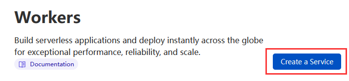
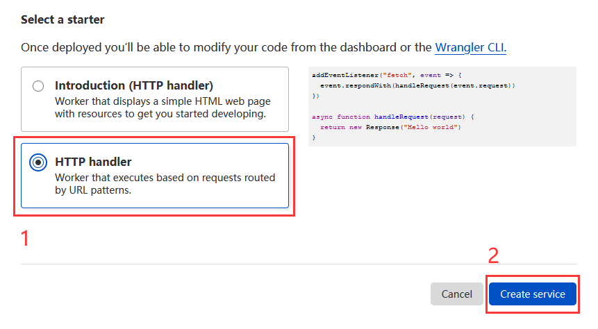
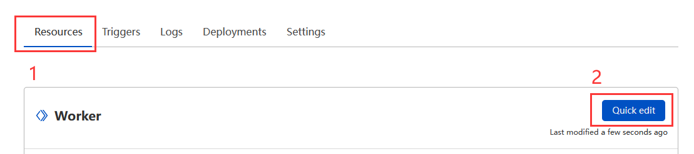
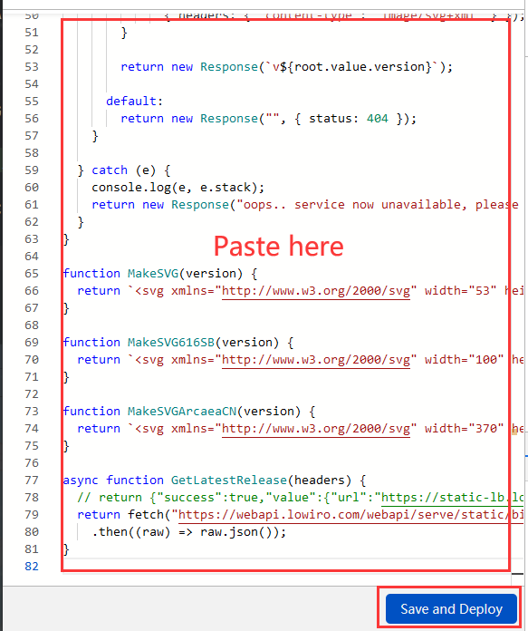
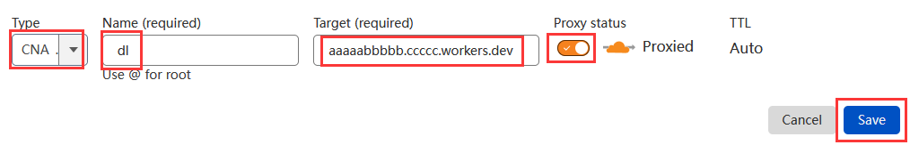
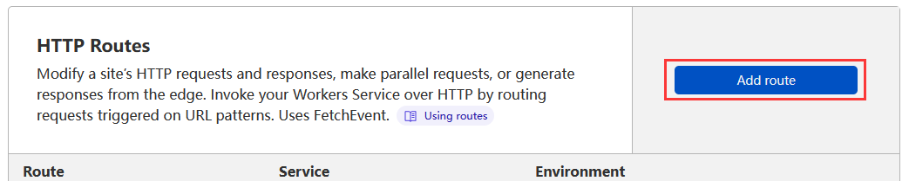

## Usage

### 1. Create a Workers:

Enter Cloudflare dashboard and go to `Workers` tab. Click `Create a Service` button.

Select `HTTP handler` and click `Create service` button.

And your service will be created. You will get a service URL such as `aaaaabbbbb.ccccc.workers.dev`.

### 2. Set up this Worker:

Go to `Resources` tab and click `Quick edit` button.

Copy the code in [index.js](index.js), and paste it into the code field. Then click `Save and Deploy` button.

Now your Worker is ready to use.

### 3. Test your Worker:

Open your browser and go to `https://aaaaabbbbb.ccccc.workers.dev/`, your browser will download the latest version of Arcaea.

### 4. Set your domain's DNS record:

Open you DNS dashboard and add a new `CNAME` record.

Note these values:

| Type    | Name               | Target                                           | Proxy status                   |
|---------|--------------------|--------------------------------------------------|--------------------------------|
| `CNAME` | `dl` (as you like) | `aaaaabbbbb.ccccc.workers.dev` (your Worker URL) | `Proxied` (Must be `Proxied `) |

And click `Save` button.

### 5. Set your domain as a route:

And go to `Workers` tab and click `Add route` button.

Enter these values:

 - `Route`: `Your domain` + `/*` (such as `dl.example.com/*`)
 - `Service`: `aaaaabbbbb` (your Worker name)

Click `Save` button.

### 6. Test your route:

Now open your browser and go to `https://dl.example.com/`, your browser will download the latest version of Arcaea.
